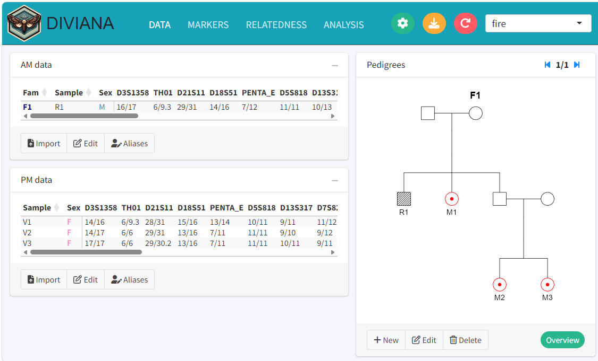

<!-- README.md is generated from README.Rmd. Please edit that file -->

```{r, include = FALSE}
knitr::opts_chunk$set(
  collapse = TRUE,
  comment = "#>",
  fig.path = "man/figures/README-",
  out.width = "100%"
)
```

# DIVIANA

DIVIANA is a Shiny app for complex *Disaster victim identification*. In particular it handles references families with multiple missing persons.

Try the online version of DIVIANA here: https://magnusdv.shinyapps.io/diviana/

## Running DIVIANA locally

If you are working with sensitive data, you should not use the online app, but run DIVIANA locally on your computer. To set this up, first install the R package from GitHub as follows:

```{r, eval = FALSE}
# install.packages("remotes")
remotes::install_github("magnusdv/diviana", dependencies = TRUE)
```

Once the installations are complete, you may launch the app with a single command:
```{r, eval = FALSE}
diviana::launchApp()
```

```{r, echo = F}

```
